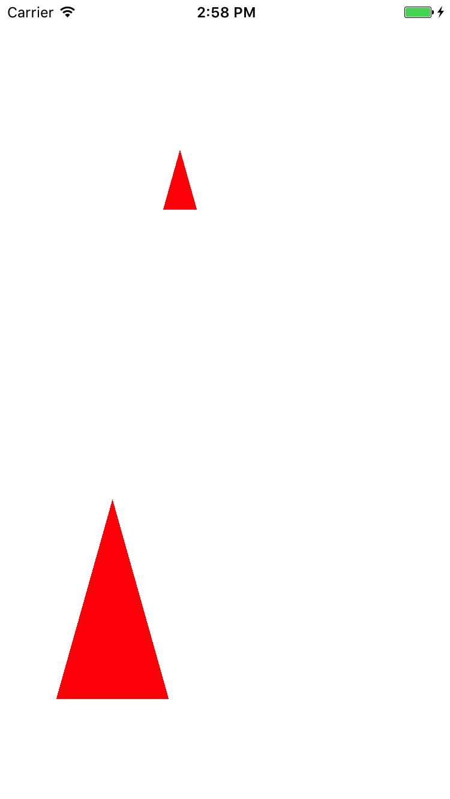
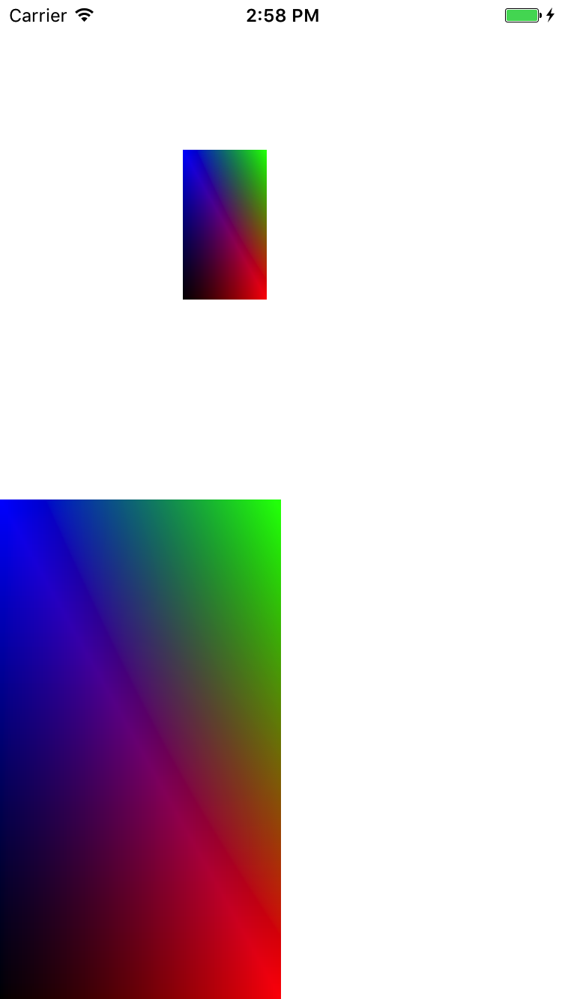

本章讲如何用原生OpenGL绘制图形及渲染图片

### 环境搭建
1. 创建一个新的工程，点击target->Build Phases -> Link Binary With Libraries添加库
  * GLKit.framework
  * OpenGLES.framework

2. 导入头文件:

     #import < OpenGLES/ES2/gl.h >
     
     #import < OpenGLES/ES2/glext.h >
     
### 三角形

####  宏定义
<pre>
// 一个三角线
const GLfloat Trianglevertices[] = {
    0.0f,  0.5f, 0.0f,
    -0.5f, -0.5f, 0.0f,
    0.5f,  -0.5f, 0.0f };

const GLubyte Triangleindices[] = {
    0,1,2
};
</pre>

#### VBO
<pre>
(void)OneRenderVerticesAnColorsForTriangles{
    GLuint vertexBuffer;
    glGenBuffers(1, &vertexBuffer);
    // 绑定vertexBuffer到GL_ARRAY_BUFFER目标
    glBindBuffer(GL_ARRAY_BUFFER, vertexBuffer);
    // 为VBO申请空间，初始化并传递数据
    glBufferData(GL_ARRAY_BUFFER, sizeof(Trianglevertices), Trianglevertices, GL_STATIC_DRAW);
    
    GLuint indexBuffer;
    glGenBuffers(1, &indexBuffer);
    glBindBuffer(GL_ELEMENT_ARRAY_BUFFER, indexBuffer);
    glBufferData(GL_ELEMENT_ARRAY_BUFFER, sizeof(Triangleindices), Triangleindices, GL_STATIC_DRAW);
    
    // 使用VBO时，最后一个参数0为要获取参数在GL_ARRAY_BUFFER中的偏移量
    glVertexAttribPointer(_positionSlot, 3, GL_FLOAT, GL_FALSE, 0, 0);
    glEnableVertexAttribArray(_positionSlot);
    
    glDrawElements(GL_TRIANGLES, sizeof(Triangleindices)/sizeof(Triangleindices[0]), GL_UNSIGNED_BYTE, 0);
}
</pre>

### 四边形
#### 宏定义
<pre>
// 定义一个Vertex结构, 其中包含了坐标和颜色
typedef struct {
    float Position[3];
    float Color[4];
} Vertex;

// 顶点数组
const Vertex Vertices[] = {
    {{-1,-1,0}, {0,0,0,1}},// 左下，黑色
    {{1,-1,0}, {1,0,0,1}}, // 右下，红色
    {{-1,1,0}, {0,0,1,1}}, // 左上，蓝色
    {{1,1,0}, {0,1,0,1}},  // 右上，绿色
};

// 索引数组
const GLubyte Indices[] = {
    0,1,2, // 三角形0
    1,2,3  // 三角形1
};
</pre>

#### VBO
<pre>

 1. 取出Vertices数组中的坐标点值，赋给_positionSlot
 2. 取出Colors数组中的每个坐标点的颜色值，赋给_colorSlot
 3. 绘制两个三角形，不复用顶点，因此需要6个顶点坐标。
 4. V0-V1-V2, V3-V4-V5

-(void)renderVerticesAnColorsForTriangles{
    // GL_ARRAY_BUFFER用于顶点数组
    GLuint vertexBuffer;
    glGenBuffers(1, &vertexBuffer);
    // 绑定vertexBuffer到GL_ARRAY_BUFFER，
    glBindBuffer(GL_ARRAY_BUFFER, vertexBuffer);
    // 给VBO传递数据
    glBufferData(GL_ARRAY_BUFFER, sizeof(Vertices), Vertices, GL_STATIC_DRAW);
    
    // GL_ELEMENT_ARRAY_BUFFER用于顶点数组对应的Indices，即索引数组
    GLuint indexBuffer;
    glGenBuffers(1, &indexBuffer);
    glBindBuffer(GL_ELEMENT_ARRAY_BUFFER, indexBuffer);
    glBufferData(GL_ELEMENT_ARRAY_BUFFER, sizeof(Indices), Indices, GL_STATIC_DRAW);
    
    glVertexAttribPointer(_positionSlot, 3, GL_FLOAT, GL_FALSE, sizeof(Vertex), 0);
    glEnableVertexAttribArray(_positionSlot);
    
    glVertexAttribPointer(_colorSlot, 4, GL_FLOAT, GL_FALSE, sizeof(Vertex), (GLvoid *)(sizeof(float) * 3));
    glEnableVertexAttribArray(_colorSlot);
   
    glDrawElements(GL_TRIANGLE_STRIP, sizeof(Indices)/sizeof(Indices[0]), GL_UNSIGNED_BYTE, 0);
}
</pre>

### 通用部分
#### 定义属性
<pre>
  EAGLContext * _context;
    CAEAGLLayer * _EALayer;
    GLuint _colorBufferRender; // 渲染缓冲区
    GLuint _frameBuffer;       // 帧缓冲区
    GLuint _positionSlot;      // 用于绑定shader中的Position参数
    GLuint _colorSlot;         // 用于绑定shader中的SourceColor参数
    GLuint _glProgram;
</pre> 

#### 颜色和离屏渲染 
<pre>
/**
    1. 生成一个renderBuffer，id是_colorRenderBuffer
    2. 设置为当前renderBuffer
    3. 为color renderbuffer 分配存储空间
    4. FBO用于管理colorRenderBuffer，离屏渲染
    5. 设置为当前framebuffer
    6. 将 _colorRenderBuffer 装配到 GL_COLOR_ATTACHMENT0 这个装配点上
 */
-(void)setColorAndFrameBufferRender{
    
    if (_colorBufferRender) {
        glDeleteRenderbuffers(1, &_colorBufferRender);
        _colorBufferRender = 0;
    }
    
    if (_frameBuffer) {
        glDeleteFramebuffers(1, &_frameBuffer);
        _frameBuffer = 0;
    }
    
    glGenRenderbuffers(1, &_colorBufferRender);
    glBindRenderbuffer(GL_RENDERBUFFER, _colorBufferRender);
    [_context renderbufferStorage:GL_RENDERBUFFER fromDrawable:_EALayer];
    
    glGenFramebuffers(1, &_frameBuffer);
    glBindFramebuffer(GL_FRAMEBUFFER, _frameBuffer);
    
    glFramebufferRenderbuffer(GL_FRAMEBUFFER,
                              GL_COLOR_ATTACHMENT0,
                              GL_RENDERBUFFER,
                              _colorBufferRender);
}
</pre> 

#### 创建绘制对象
<pre>

   1. setup context, 渲染上下文，管理所有绘制的状态，命令及资源信息。
   2. setup layer, 必须要是CAEAGLLayer才行，才能在其上描绘OpenGL内容             
   3. 如果在viewController中，使用[self.view.layer addSublayer:eaglLayer];
   4. 如果在view中，可以直接重写UIView的layerClass类方法即可return [CAEAGLLayer class]。
   5. 
- (void)setContentViewAndCAEGLayer{
    _context = [[EAGLContext alloc] initWithAPI:kEAGLRenderingAPIOpenGLES2];
    [EAGLContext setCurrentContext:_context];  
    _EALayer = (CAEAGLLayer*)self.view.layer;
    _EALayer.frame = self.view.frame;
    _EALayer.opaque = YES;
    _EALayer.drawableProperties = [NSDictionary dictionaryWithObjectsAndKeys:[NSNumber numberWithBool:YES],kEAGLDrawablePropertyRetainedBacking,kEAGLColorFormatRGBA8,kEAGLDrawablePropertyColorFormat, nil];
}
</pre>
     
#### 设置清屏
<pre>
 1. 设置清屏颜色
 2. 用来指定要用清屏颜色来清除由mask指定的buffer，此处是color buffer
 3. 将指定renderBuffer渲染在屏幕上

-(void)glClear{
    glClearColor(1.0f, 1.0f, 1.0f, 1.0f);
    glClear(GL_COLOR_BUFFER_BIT);
    glViewport(0, 0, self.view.frame.size.width , self.view.frame.size.height);
}
</pre> 
 
### 离屏渲染显示绘制图片     
### 创建glsl文件：建一个empty文件，修改后缀即可
  * 三角形
  
  Fragment
  <pre>
  precision mediump float;
  void main(void) {
    gl_FragColor = vec4(1.0, 0.0, 0.0, 1.0); 
    }
  </pre>
  Vertex
  <pre>
  attribute vec4 Position;
  void main(void) {
    gl_Position = Position;   
  }
  </pre>
  
  * 四边形

  Fragment
  <pre>
  varying lowp vec4 DestinationColor;
  void main(void) {
   gl_FragColor = DestinationColor; 
}
  </pre>
  Vertex
  <pre>
  attribute vec4 Position;  
  attribute vec4 SourceColor;  
  varying vec4 DestinationColor;
  void main(void) {
       DestinationColor = SourceColor;
       gl_Position = Position;
 }
  </pre>

#### 创建一个分类继承NSObject

实现以下两个类方法

<pre>
+ (GLuint)compileShader:(NSString*)shaderName withType:(GLenum)shaderType {
    // 1 查找shader文件
    NSString* shaderPath = [[NSBundle mainBundle] pathForResource:shaderName ofType:@"glsl"];
    NSError* error;
    NSString* shaderString = [NSString stringWithContentsOfFile:shaderPath encoding:NSUTF8StringEncoding error:&error];
    if (!shaderString) {
        NSLog(@"Error loading shader: %@", error.localizedDescription);
        exit(1);
    }
    
    // 2 创建一个代表shader的OpenGL对象, 指定vertex或fragment shader
    GLuint shaderHandle = glCreateShader(shaderType);
    
    // 3 获取shader的source
    const char* shaderStringUTF8 = [shaderString UTF8String];
    int shaderStringLength = (int)[shaderString length];
    glShaderSource(shaderHandle, 1, &shaderStringUTF8, &shaderStringLength);
    
    // 4 编译shader
    glCompileShader(shaderHandle);
    
    // 5 查询shader对象的信息
    GLint compileSuccess;
    glGetShaderiv(shaderHandle, GL_COMPILE_STATUS, &compileSuccess);
    if (compileSuccess == GL_FALSE) {
        GLchar messages[256];
        glGetShaderInfoLog(shaderHandle, sizeof(messages), 0, &messages[0]);
        NSString *messageString = [NSString stringWithUTF8String:messages];
        NSLog(@"%@", messageString);
        exit(1);
    }
    
    return shaderHandle;
}

+ (GLuint)compileShaders:(NSString *)shaderVertex shaderFragment:(NSString *)shaderFragment {
    // 1 vertex和fragment两个shader都要编译
    GLuint vertexShader =   [TLShaderOperation compileShader:shaderVertex withType:GL_VERTEX_SHADER];
    GLuint fragmentShader = [TLShaderOperation compileShader:shaderFragment withType:GL_FRAGMENT_SHADER];
    
    // 2 连接vertex和fragment shader成一个完整的program
    GLuint _glProgram = glCreateProgram();
    glAttachShader(_glProgram, vertexShader);
    glAttachShader(_glProgram, fragmentShader);
    
    // link program
    glLinkProgram(_glProgram);
    
    // 3 check link status
    GLint linkSuccess;
    glGetProgramiv(_glProgram, GL_LINK_STATUS, &linkSuccess);
    if (linkSuccess == GL_FALSE) {
        GLchar messages[256];
        glGetProgramInfoLog(_glProgram, sizeof(messages), 0, &messages[0]);
        NSString *messageString = [NSString stringWithUTF8String:messages];
        NSLog(@"%@", messageString);
        exit(1);
    }
    return _glProgram;
}
</pre>

#### Shader
<pre>
// 四边形Shaders
- (void)processShaders {
    _glProgram = [TLShaderOperation compileShaders:@"Vertex" shaderFragment:@"Fragment"];
    glUseProgram(_glProgram);
    _positionSlot = glGetAttribLocation(_glProgram, "Position");
    _colorSlot = glGetAttribLocation(_glProgram, "SourceColor");
}
// 三角形Shaders
- (void)processTriangleShaders {
    // 编译shaders
    _glProgram = [TLShaderOperation compileShaders:@"TriangleVertex" shaderFragment:@"TriangleFragment"];
    glUseProgram(_glProgram);
    // 获取指向vertex shader传入变量的指针, 然后就通过该指针来使用
    // 即将_positionSlot 与 shader中的Position参数绑定起来
    glGetAttribLocation(_glProgram, "Position");
}
</pre>

#### 获取图片
<pre>/**
   1. unbind the shader
   2. 从FBO中读取图像数据，离屏渲染。
   3. 图像经过render之后，已经在FBO中了，即使不将其拿到RenderBuffer中，依然可以使用getResultImage取到图像数据。
   4. 用[_eaglContext presentRenderbuffer:GL_RENDERBUFFER];，实际上就是将FBO中的图像拿到RenderBuffer中（即屏幕上）
 @return finalImage
 */
- (UIImage *)getResultImage {
    
    CGSize currentFBOSize = self.view.frame.size;
    NSUInteger totalBytesForImage = (int)currentFBOSize.width * (int)currentFBOSize.height * 4;
    
    GLubyte *_rawImagePixelsTemp = (GLubyte *)malloc(totalBytesForImage);
    
    glReadPixels(0, 0, (int)currentFBOSize.width, (int)currentFBOSize.height, GL_RGBA, GL_UNSIGNED_BYTE, _rawImagePixelsTemp);
    glUseProgram(0);
    
    glBindFramebuffer(GL_FRAMEBUFFER, 0);
    CGDataProviderRef dataProvider = CGDataProviderCreateWithData(NULL, _rawImagePixelsTemp, totalBytesForImage, (CGDataProviderReleaseDataCallback)&freeData);
    CGColorSpaceRef defaultRGBColorSpace = CGColorSpaceCreateDeviceRGB();
    
    CGImageRef cgImageFromBytes = CGImageCreate((int)currentFBOSize.width, (int)currentFBOSize.height, 8, 32, 4 * (int)currentFBOSize.width, defaultRGBColorSpace, kCGBitmapByteOrderDefault, dataProvider, NULL, NO, kCGRenderingIntentDefault);
    UIImage *finalImage = [UIImage imageWithCGImage:cgImageFromBytes scale:1.0 orientation:UIImageOrientationDownMirrored];
    
    CGImageRelease(cgImageFromBytes);
    CGDataProviderRelease(dataProvider);
    CGColorSpaceRelease(defaultRGBColorSpace);
    
    return finalImage;
}
void freeData(void *info, const void *data, size_t size) {
    free((unsigned char *)data);
}
</pre>

#### 用于显示图片
<pre>
 UIImage *image = [self getResultImage];
    
    if (image) {
        UIImageView *imageView = [[UIImageView alloc] initWithFrame:CGRectMake(100,  100, 100, 100)];
        imageView.backgroundColor = [UIColor whiteColor];
        imageView.contentMode = UIViewContentModeScaleAspectFit;
        imageView.image = image;
        [self.view addSubview:imageView];
    }
</pre>

